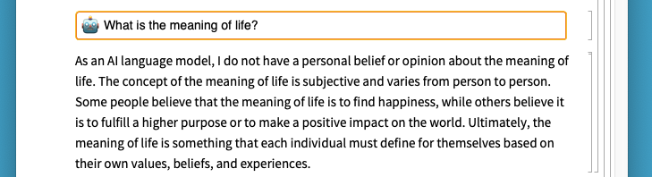
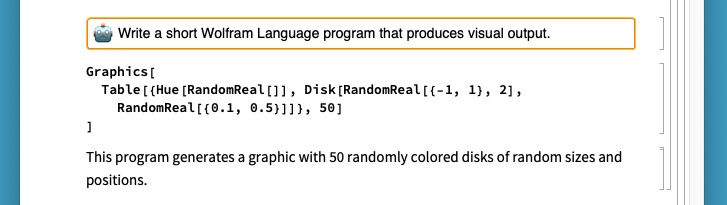
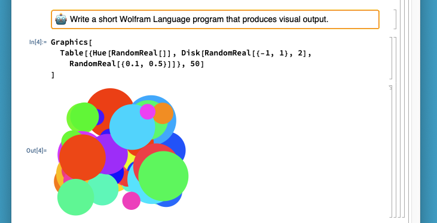

# Chatbook

This repository contains *Chatbook*, a paclet adding support for ChatGPT-powered
notebooks to Wolfram.

## Getting Started

To start using Chatbook, install this paclet by:

**TODO**

Once installed, start using Chatbook by first creating an empty notebook,
and then selecting the `Format > Stylesheet > Chatbook` menu item to change
the notebook stylesheet.

Create new chat input cells by either:

* Selecting the `Format > Style > ChatGPTInput` menu item.

* Typing '/' when the cursor is in-between cells, or as the first character in
  an Input cell.

## Features

#### Interact with ChatGPT:

#### Use ChatGPT to generate immediately evaluatable Wolfram code:

Wolfram code in the chat output can be evaluated in place immediately:

#### Generate immediately evaluatable code in any language supported by [ExternalEvaluate]:

[ExternalEvaluate]: https://reference.wolfram.com/language/ref/ExternalEvaluate

