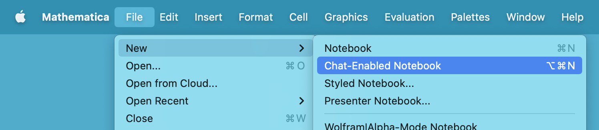

# Changelog

All notable changes to this project will be documented in this file.

The format is based on [Keep a Changelog](https://keepachangelog.com/en/1.0.0/),
and this project adheres to [Semantic Versioning](https://semver.org/spec/v2.0.0.html).

## [Unreleased]

### Added

* Added 'File > New > Chat-Enabled Notebook' menu item. ([#68])

## [0.0.9] — 2023-04-20

Initial release on the Wolfram Language Paclet Repository.

### Changed

- Use `'` single quote instead of `/` as style key for chat input cells. ([#40])

<!-- ## [0.0.2] - YYYY-MM-DD

### Added

- Added something ([#2])

### Changed

- Fixed something ([#3])

## [0.0.1] - YYYY-MM-DD

Initial release.

### Added

- Added all initial functionality ([#1]) -->

<!-- v0.0.9 -->
[#40]: https://github.com/ConnorGray/Chatbook/pull/40

<!-- Unreleased -->
[#68]: https://github.com/ConnorGray/Chatbook/pull/68

<!-- This needs to be updated for each tagged release. -->
[Unreleased]: https://github.com/ConnorGray/Chatbook/compare/v0.0.9...HEAD

<!-- [0.0.2]: https://github.com/OWNER/REPO/compare/v0.0.1...v0.0.2 -->
[0.0.9]: https://github.com/ConnorGray/Chatbook/releases/tag/v0.0.9