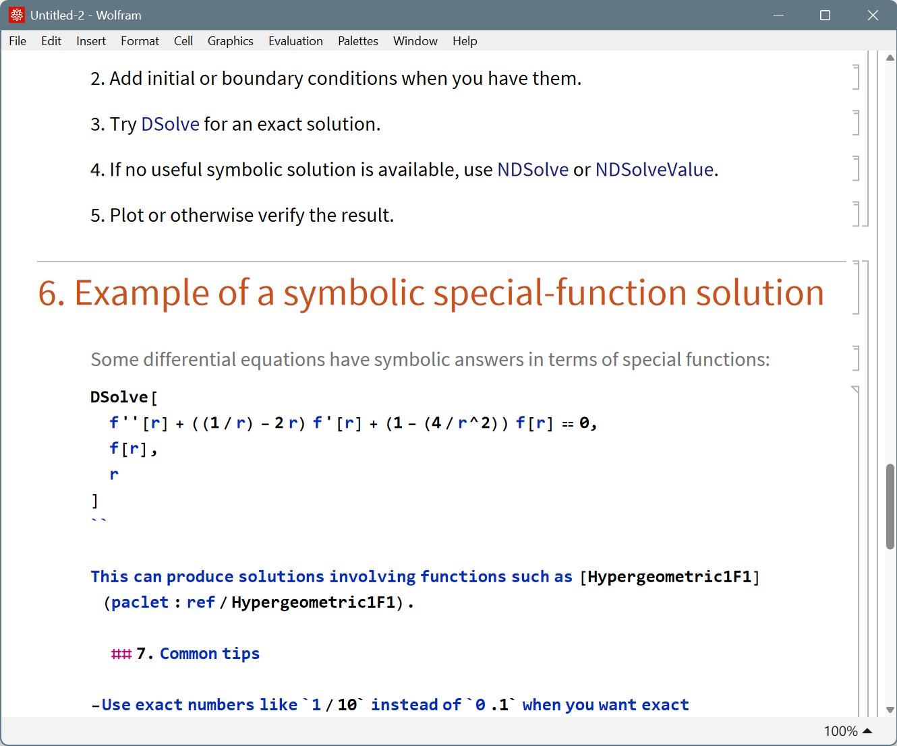
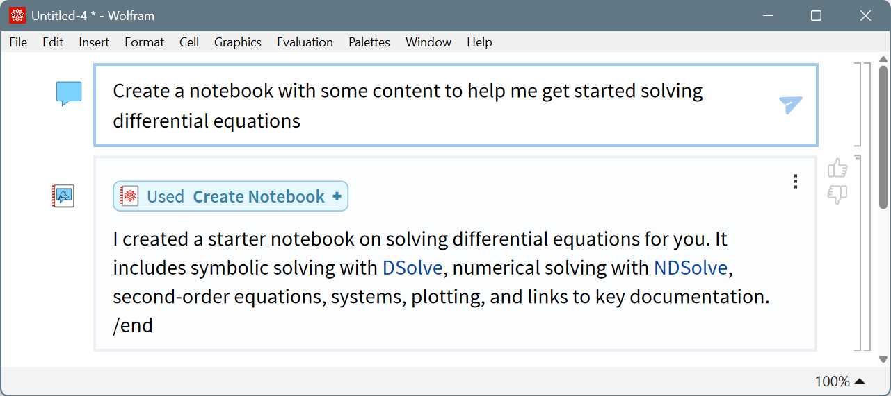

# Case Study: Adding GPT 5.4 Support

This page walks through the process of adding support for OpenAI's GPT 5.4 model family. The changes span ~10 source files and cover model registration, settings configuration, new prompt components, formatting improvements, and message pipeline fixes.

This is a companion to [How to Add Support for a New Model](../adding-model-support.md), which covers foundational concepts like model families, the settings resolution hierarchy, and `Missing["NotSupported"]`. This page assumes familiarity with that guide and focuses on the iterative problem-solving process.

**GPT 5.4 characteristics:**
- 1M+ token context window
- Support for multi-modal input (images and text)
- Doesn't allow reasoning when using tools via the completions endpoint

---

## Part 1: Basic Model Registration

The first step is always the same: teach Chatbook to recognize the model and declare its capabilities. See [Simple Model Addition](../adding-model-support.md#simple-model-addition) for the general pattern.

### Model Family Classification

GPT 5.4 is part of a larger GPT 5.x family with sub-variants. Seven `chooseModelFamily0` rules were added in `Source/Chatbook/Models.wl`:

```wl
chooseModelFamily0[ wordsPattern[ { "GPT", "5.1", ___ } ] ] := "GPT51";
chooseModelFamily0[ wordsPattern[ { "GPT", "5.2", ___ } ] ] := "GPT52";
chooseModelFamily0[ wordsPattern[ { "GPT", "5.3", "Chat", ___ } ] ] := "GPT53Chat";
chooseModelFamily0[ wordsPattern[ { "GPT", "5.3", ___ } ] ] := "GPT53";
chooseModelFamily0[ wordsPattern[ { "GPT", "5.4", ___ } ] ] := "GPT54";
chooseModelFamily0[ wordsPattern[ { "GPT", "5."~~DigitCharacter, ___ } ] ] := "GPT54";
chooseModelFamily0[ wordsPattern[ { "GPT", "5", ___ } ] ] := "GPT5";
```

**Ordering details:**
- `"GPT53Chat"` must come before `"GPT53"` because the Chat variant's pattern is more specific (it includes `"Chat"` as a required third word).
- The `"5."~~DigitCharacter` rule is a future-proofing catch-all that routes any unknown 5.x model (e.g., a hypothetical "gpt-5.7") to GPT54 settings as a reasonable default, rather than falling back to the less-capable base GPT5 settings.
- `"GPT5"` is last, catching any generic "gpt-5" model string.

### Settings Inheritance Chain

GPT 5.x uses association splatting to build an incremental inheritance chain. Each generation inherits from its predecessor and overrides only what changes. See [Setting inheritance for model variants](../adding-model-support.md#setting-inheritance-for-model-variants) for the general pattern.

The full chain in `Source/Chatbook/Settings.wl`:

```wl
(* Base GPT-5 settings *)
$modelAutoSettings[ Automatic, "GPT5" ] = <|
    "HybridToolMethod"           -> False,
    "MaxContextTokens"           -> 400000,
    "Multimodal"                 -> True,
    "PresencePenalty"            -> Missing[ "NotSupported" ],
    "Reasoning"                  :> If[ TrueQ @ $gpt5Reasoning, "Minimal", Missing[ "NotSupported" ] ],
    "StopTokens"                 -> Missing[ "NotSupported" ],
    "Temperature"                -> Missing[ "NotSupported" ],
    "TokenizerName"              -> "gpt-4o",
    "ToolCallExamplePromptStyle" -> "Basic",
    "ToolCallRetryMessage"       -> False,
    "ToolMethod"                 -> "Service"
|>;

(* GPT-5.1 inherits from GPT-5, changes reasoning level *)
$modelAutoSettings[ Automatic, "GPT51" ] = <|
    $modelAutoSettings[ Automatic, "GPT5" ],
    "Reasoning" :> If[ TrueQ @ $gpt5Reasoning, "None", Missing[ "NotSupported" ] ]
|>;

(* GPT-5.2 inherits from GPT-5.1, enables on-demand prompts and unicode handling *)
$modelAutoSettings[ Automatic, "GPT52" ] = <|
    $modelAutoSettings[ Automatic, "GPT51" ],
    "EnabledBasePrompts"       -> { "FunctionRepositoryIntegration", "WolframLanguageEvaluatorToolInteractive" },
    "ExcludedBasePrompts"      -> { ParentList, "EscapedCharacters" },
    "ReplaceUnicodeCharacters" -> True
|>;

(* GPT-5.3 is identical to GPT-5.2 *)
$modelAutoSettings[ Automatic, "GPT53" ] =
    $modelAutoSettings[ Automatic, "GPT52" ];

(* GPT-5.3-Chat: smaller context window variant *)
$modelAutoSettings[ Automatic, "GPT53Chat" ] = <|
    $modelAutoSettings[ Automatic, "GPT53" ],
    "MaxContextTokens" -> 128000
|>;

(* GPT-5.4: largest context, hybrid tools, no reasoning with tools *)
$modelAutoSettings[ Automatic, "GPT54" ] = <|
    $modelAutoSettings[ Automatic, "GPT53" ],
    "EndToken"                   -> None,
    "HybridToolMethod"           -> True,
    "MaxContextTokens"           -> 1050000,
    "Reasoning"                  -> Missing[ "NotSupported" ],
    "ToolCallExamplePromptStyle" -> Automatic,
    "ToolMethod"                 -> Verbatim @ Automatic
|>;
```

**GPT54 settings explained:**

| Setting | Value | Why |
|---------|-------|-----|
| `"EndToken"` | `None` | GPT 5.4 doesn't need an end-of-turn token and sometimes emits it incorrectly. See [Issue 2](#issue-2-disabling-the-end-token). |
| `"HybridToolMethod"` | `True` | Avoids JSON syntax errors in long tool arguments. See [Issue 1](#issue-1-switching-to-hybrid-tool-calling). |
| `"MaxContextTokens"` | `1050000` | GPT 5.4 has a 1M+ token context window. |
| `"Reasoning"` | `Missing["NotSupported"]` | Reasoning mode does not work with tools in the completions endpoint. |
| `"ToolCallExamplePromptStyle"` | `Automatic` | Use the default example prompt style. |
| `"ToolMethod"` | `Verbatim @ Automatic` | Required for hybrid tool calling; `Verbatim` prevents `Automatic` from resolving further down the hierarchy. |

---

## Part 2: Behavioral Issues and Fixes

Registering the model is just the beginning. During testing, we discovered several behavioral issues with GPT 5.4 that required targeted fixes across formatting, prompting, and the message pipeline.

### Issue 1: Switching to Hybrid Tool Calling

**Problem:** GPT 5.4 would write long markdown content as tool arguments for the CreateNotebook tool. When using the service-level tool calling API (where arguments are JSON-encoded), the model made JSON syntax errors -- unescaped quotes, improper line breaks, etc. This caused tool calls to fail or produce malformed output.



**Solution:** Enable hybrid tool calling, which combines service-level tool calling with prompt-based plain-text tool arguments. The model can write tool arguments as plain text instead of being forced into JSON.

**Where:** `Source/Chatbook/Settings.wl`

```wl
$modelAutoSettings[ Automatic, "GPT54" ] = <|
    ...,
    "HybridToolMethod" -> True,
    "ToolMethod"       -> Verbatim @ Automatic
|>;
```

`Verbatim @ Automatic` is required because without `Verbatim`, the `Automatic` value would trigger further resolution in the settings hierarchy, potentially resolving to `"Service"`. `Verbatim @ Automatic` explicitly says "this setting IS Automatic" and short-circuits the lookup.

### Issue 2: Disabling the End Token

**Problem:** The `"EndToken"` setting (default: `"/end"`) is a text-based signal used by older, less-capable models to indicate they are done with their turn when using prompt-based tool calling. GPT 5.4 would sometimes emit `/end` incorrectly, terminating its response prematurely.



**Solution:** Set `"EndToken" -> None` to disable the end token entirely. GPT 5.4 handles turn-taking without this signal.

**Where:** `Source/Chatbook/Settings.wl`

When `$endToken` is `None` or not a string, the `"EndTurnToken"` base prompt component produces `None` and is omitted from the system prompt. See the conditional in `Source/Chatbook/Prompting.wl`:

```wl
$basePromptComponents[ "EndTurnToken" ] :=
    If[ StringQ @ $endToken && $endToken =!= "",
        "* Always end your turn by writing " <> $endToken <> ".",
        None
    ];
```

### Issue 3: Inline Wolfram Language Code Rendering

**Problem:** GPT 5.4 writes significantly more inline code using backticks for Wolfram Language expressions (e.g., `` `DateListPlot[data]` ``, `` `"ExampleData/sunspot.dat"` ``, `` `Plot -> ListPlot` ``). The existing `almostCertainlyWLCodeQ` function only detected WL code at the start of inline text and missed common patterns like arrow rules and quoted strings. These rendered as plain monospace text instead of syntax-highlighted WL cells.

**Solution:** Enhance `almostCertainlyWLCodeQ` with an `inline` parameter and create a new `"InlineWL"` cell style with syntax highlighting.

**Where:** `Source/Chatbook/Formatting.wl`, `Source/Chatbook/Serialization.wl`

Detection logic (`Formatting.wl`):

```wl
almostCertainlyWLCodeQ[ wl_String ] := almostCertainlyWLCodeQ[ wl, False ];

almostCertainlyWLCodeQ[ wl_String, inline_ ] := TrueQ @ Or[
    If[ TrueQ @ inline, StringContainsQ, StringStartsQ ][ wl, "\[FreeformPrompt]" ],
    StringMatchQ[
        wl,
        (name: Repeated[ _, { 1, 50 } ] /; systemNameQ @ name) ~~ Alternatives[
            "[" ~~ ___ ~~ "]",
            $$ws ~~ ("->"|":>") ~~ __
        ]
    ],
    TrueQ @ inline && StringMatchQ[ wl, "\"" ~~ ___ ~~ "\"" ]
];
```

New patterns added for inline mode:
- Arrow operators (`->`, `:>`) catch rule specifications like `Plot -> ListPlot`
- Quoted strings (`"..."`) catch file paths and string literals like `"ExampleData/sunspot.dat"`

New cell style (`Formatting.wl`):

```wl
makeInlineWL[ code_String ] := Cell[
    BoxData @ wlStringToBoxes @ code,
    "InlineWL", "Input",
    LanguageCategory     -> "Input",
    ShowAutoStyles       -> True,
    ShowStringCharacters -> True,
    ShowSyntaxStyles     -> True
];
```

The caller was updated to pass the inline flag (`Formatting.wl`):

```wl
(* Before: makeInlineCodeCell[ code_String? almostCertainlyWLCodeQ ] *)
(* After:                                                             *)
makeInlineCodeCell[ code_String /; almostCertainlyWLCodeQ[ code, True ] ] :=
    makeInlineWL @ code;
```

The original code used `almostCertainlyWLCodeQ` as a `PatternTest` (`?`), which only passes one argument. The new version uses an explicit `/;` condition to pass the `True` inline parameter.

Three `boxToString` patterns in `Serialization.wl` were updated to recognize `"InlineWL"` alongside `"InlineCode"` and `"InlineFormula"`, so that these cells serialize back to markdown correctly when included in chat history:

```wl
boxToString[
    Cell[ BoxData[ link: TemplateBox[ _, $$refLinkTemplate, ___ ], ___ ],
          "InlineCode"|"InlineFormula"|"InlineWL", ___ ]
] /; ! $inlineCode := boxToString @ link;
```

### Issue 4: Resource Function Link Formatting

**Problem:** GPT 5.4 frequently links to Wolfram Function Repository entries using the markdown pattern `` [`ResourceFunction["name"]`](url) ``. The backticks around the ResourceFunction expression inside the link label were not handled by the existing markdown rules, resulting in broken rendering.

**Solution:** Add a new markdown rule that matches this specific pattern and render the ResourceFunction expression as an inline WL code cell. Also relax the `hyperlink` function to tolerate backtick-wrapped labels.

**Where:** `Source/Chatbook/Formatting.wl`

New markdown rule (placed before the generic backtick-label link rule in `$textDataFormatRules`):

```wl
"[`ResourceFunction[" ~~ name: Except[ "[" ].. ~~ "]`](" ~~ Except[ ")" ].. ~~ ")" :>
    inlineCodeCell[ "ResourceFunction[" <> name <> "]" ]
```

Updated hyperlink pattern (allows optional leading/trailing backticks):

```wl
hyperlink[ rf_String, uri_ ] /;
    StringMatchQ[ rf, ("`"|"") ~~ "ResourceFunction[" ~~ ___ ~~ "]" ~~ ("`"|"") ] :=
        makeInlineWL @ rf;
```

### Issue 5: Dynamic Prompting for RAG-Discovered Content

The next set of issues involve making GPT 5.4 respond better to content discovered at runtime through the RAG (Related Documentation) system. The model was capable of handling this information well, but needed specific prompting to change default behaviors.

#### The On-Demand Base Prompt Mechanism

**Problem:** Some prompt components are only useful for specific models AND only relevant when specific content appears in RAG results. Including them unconditionally would waste tokens for all models. Excluding them entirely would miss opportunities for capable models.

**Solution:** Introduce a two-layer gating mechanism: prompts that are *disabled by default* but can be *enabled per-model*, and which only fire when specific content triggers them at runtime.

**Where:** `Source/Chatbook/Prompting.wl` (mechanism), `Source/Chatbook/Settings.wl` (setting), `Source/Chatbook/CommonSymbols.wl` (symbol), `Source/Chatbook/ChatState.wl` (state)

`$disabledBasePrompts` is a list of prompts disabled by default. The `needsBasePrompt` function treats disabled prompts the same as excluded prompts -- as a no-op (`Prompting.wl`):

```wl
(* These base prompts are disabled by default, so that `needsBasePrompt["promptName"]`
   is a no-op, unless explicitly enabled via the "EnabledBasePrompts" setting. *)
$disabledBasePrompts = {
    "FunctionRepositoryIntegration",
    "WolframLanguageEvaluatorToolInteractive"
};

needsBasePrompt[ name_String ] /; MemberQ[ $excludedBasePrompts, name ] := name;
needsBasePrompt[ name_String ] /; MemberQ[ $disabledBasePrompts, name ] := name;
needsBasePrompt[ name_String ] /; KeyExistsQ[ $collectedPromptComponents, name ] := name;
needsBasePrompt[ name_String ] := $collectedPromptComponents[ name ] = name;
```

Models opt in via the `"EnabledBasePrompts"` setting. During `resolveAutoSettings`, enabled prompts are removed from `$disabledBasePrompts` via `Complement` (`Settings.wl`):

```wl
(* Global default: no prompts enabled beyond the standard set *)
$modelAutoSettings[ Automatic, Automatic ] = <|
    ...,
    "EnabledBasePrompts" -> { },
    ...
|>;

(* GPT-5.2+ enables on-demand prompts *)
$modelAutoSettings[ Automatic, "GPT52" ] = <|
    ...,
    "EnabledBasePrompts" -> {
        "FunctionRepositoryIntegration",
        "WolframLanguageEvaluatorToolInteractive"
    },
    ...
|>;
```

Resolution logic (`Settings.wl`):

```wl
$disabledBasePrompts = Complement[
    $disabledBasePrompts,
    Flatten @ { resolved[ "EnabledBasePrompts" ] }
];
```

After this, `needsBasePrompt["FunctionRepositoryIntegration"]` is no longer a no-op for GPT 5.2+ models -- it actually registers the prompt component. But the prompt still only fires when `needsBasePrompt` is actually called. The call sites in `RelatedDocumentation.wl` determine *when* it fires.

#### Resource Function Prompt Triggering

**Problem:** When RAG results contained Wolfram Function Repository entries instead of built-in symbols, GPT 5.4 would say "Wolfram Language doesn't natively support X" rather than offering the resource function solution that was right in the documentation snippets.

**Solution:** When RAG results contain WFR snippets (lines starting with `"# WFR > "`), call `needsBasePrompt["FunctionRepositoryIntegration"]` to add a prompt telling the model to treat ResourceFunctions as first-class citizens.

**Where:** `Source/Chatbook/PromptGenerators/RelatedDocumentation.wl`, `Source/Chatbook/Prompting.wl`

Trigger (`RelatedDocumentation.wl`):

```wl
If[ StringContainsQ[ string, StartOfLine ~~ "# WFR > " ],
    needsBasePrompt[ "FunctionRepositoryIntegration" ]
];
```

Prompt text (`Prompting.wl`):

```wl
$basePromptComponents[ "FunctionRepositoryIntegration" ] = "\
* ResourceFunctions published in the Function Repository are reviewed and \
approved by Wolfram staff, so you can treat them as first-class citizens of \
the Wolfram Language if there isn't already a built-in equivalent.";
```

The `"# WFR > "` prefix is the format used by the snippet system for Wolfram Function Repository documentation. For models that have NOT enabled `"FunctionRepositoryIntegration"` via `"EnabledBasePrompts"`, the `needsBasePrompt` call is silently ignored.

#### ExampleData File Hints

**Problem:** Documentation snippets frequently reference `ExampleData/` files (e.g., `"ExampleData/sunspot.dat"`, `"ExampleData/coneflower.jpg"`). GPT 5.4 would see these in the documentation but not use them, instead generating placeholder paths like `"path/to/file.ext"` that would fail when evaluated.

**Solution:** Scan RAG results for valid ExampleData file references, verify they exist, and append a system hint listing them.

**Where:** `Source/Chatbook/PromptGenerators/RelatedDocumentation.wl`, `Source/Chatbook/Prompting.wl`

The `addExampleDataHint` function (`RelatedDocumentation.wl`):

```wl
addExampleDataHint[ string_String ] := Enclose[
    Catch @ Module[ { exampleDataFiles, hintText },

        exampleDataFiles = Union @ StringCases[
            string,
            "\"" ~~ path: Shortest[ "ExampleData/" ~~ Except[ "\"" ].. ] ~~ "\""
                /; exampleDataFileQ @ path :> path
        ];

        If[ exampleDataFiles === { }, Throw @ string ];

        hintText = ConfirmBy[
            TemplateApply[
                $exampleDataHintTemplate,
                <|
                    "Files" -> StringRiffle[ "* \"" <> # <> "\"" & /@ exampleDataFiles, "\n" ],
                    "First" -> First @ exampleDataFiles
                |>
            ],
            StringQ,
            "HintText"
        ];

        needsBasePrompt[ "ExampleDataFiles" ];

        StringJoin[ string, "\n\n", hintText ]
    ],
    throwInternalFailure
];
```

The hint template explains that `ExampleData/` is on `$Path` and lists available files:

````wl
$exampleDataHintTemplate = StringTemplate[ "\
<system-hint>
The \"ExampleData/\" directory is included in every Wolfram Language installation \
and is automatically on $Path, so paths like \"ExampleData/coneflower.jpg\" can \
be used immediately without any setup.

Available ExampleData files from the snippets above:
%%Files%%

You can use the following to find the list of all available ExampleData files:

```wl
FileNameTake /@ FileNames[All, DirectoryName[FindFile[\"%%First%%\"]]]
```
</system-hint>", Delimiters -> "%%" ];
````

File existence is validated with caching (`RelatedDocumentation.wl`):

```wl
exampleDataFileQ[ path_String ] := exampleDataFileQ[ path ] = StringQ @ Quiet @ FindFile @ path;
```

The `"ExampleDataFiles"` prompt component is NOT in `$disabledBasePrompts`, so it is available to all models. The gating happens implicitly: `addExampleDataHint` only calls `needsBasePrompt["ExampleDataFiles"]` when valid ExampleData files are found in snippets.

Prompt text (`Prompting.wl`):

```wl
$basePromptComponents[ "ExampleDataFiles" ] = "\
* When writing example code that imports files and the user has not specified a \
particular file, use real ExampleData files instead of placeholder paths like \
\"path/to/file.ext\".";
```

#### Interactive Content Prompt

**Problem:** When users asked for interactive content (e.g., a `Manipulate`), GPT 5.4 would use the CreateNotebook tool to create a separate notebook containing the interactive expression, instead of using the WolframLanguageEvaluatorTool to evaluate it inline in the chat.

**Solution:** Add a `"WolframLanguageEvaluatorToolInteractive"` base prompt and make it a dependency of `"WolframLanguageEvaluatorTool"`. It is disabled by default and enabled for GPT 5.2+ via `"EnabledBasePrompts"`.

**Where:** `Source/Chatbook/Prompting.wl`

Prompt text:

```wl
$basePromptComponents[ "WolframLanguageEvaluatorToolInteractive" ] = "\
* You can generate interactive content (e.g. Manipulate) using the \
wolfram_language_evaluator tool.";
```

Dependency declaration (so it is automatically included whenever the evaluator tool prompt is present, for models that have it enabled):

```wl
"WolframLanguageEvaluatorTool" -> { "WolframLanguageStyle", "WolframLanguageEvaluatorToolInteractive" },
```

The `needsBasePrompt` disabled guard prevents the dependency from activating for models that have not opted in.

---

## Part 3: Message Pipeline Reordering

### Issue 6: Base Prompt Substitution Timing

**Problem:** The `constructMessages` function in `ChatMessages.wl` builds the final message list sent to the LLM. Previously, base prompt removal (via `removeBasePrompt`) and `<base-prompt>` tag substitution happened BEFORE prompt generators (RAG) ran and inserted their results. This meant that dynamically triggered base prompt components (like `"FunctionRepositoryIntegration"`) could not be included because the prompt had already been assembled.

**Solution:** Move base prompt removal and substitution to AFTER prompt generator results are inserted. Also change the error fallback from `messages` to `combined` to preserve generator results on failure.

**Where:** `Source/Chatbook/ChatMessages.wl`

The reordered pipeline (simplified):

```wl
constructMessages[ settings_, messages0_ ] := Enclose @ Module[
    { prompted, messages, merged, combined, base, processed },

    (* 1. Register conditional prompts based on settings *)
    If[ discourageExtraToolCallsQ @ settings, needsBasePrompt[ "DiscourageExtraToolCalls" ] ];
    needsBasePrompt @ settings;

    (* 2. Add system prompt templates with <base-prompt> placeholders *)
    prompted = addPrompts[ settings, ... ];

    (* 3. Clean up ENDRESULT hashes *)
    messages = prompted /. s_String :> RuleCondition @ StringTrim @ StringReplace[ s, ... ];

    (* 4. Merge and run prompt generators (RAG, WolframAlpha, etc.) *)
    (*    These may call needsBasePrompt for on-demand components *)
    merged = ...;
    combined = Insert[ merged, generatedMessages, genPos ];

    (* 5. NOW build and substitute the base prompt *)
    (*    This captures ALL needsBasePrompt calls from steps 1-4 *)
    removeBasePrompt @ settings[ "ExcludedBasePrompts" ];
    base = "<base-prompt>" <> $basePrompt <> "</base-prompt>";
    combined = combined /.
        s_String :> RuleCondition @ StringTrim @ StringReplace[
            s,
            Shortest[ "<base-prompt>"~~___~~"</base-prompt>" ] -> base
        ];

    (* 6. Apply user processing function *)
    processed = applyProcessingFunction[ settings, "ChatMessages", ... ];

    (* 7. Fallback uses combined (not messages) to preserve generator results *)
    If[ ! MatchQ[ processed, $$validMessageResults ],
        processed = combined
    ];
    ...
];
```

Before this change, step 5 happened between steps 2 and 3. This meant that when prompt generators (step 4) called `needsBasePrompt["FunctionRepositoryIntegration"]`, the base prompt had already been built without it.

The fallback change (`combined` instead of `messages`) ensures that if `applyProcessingFunction` fails, the returned messages still include prompt generator output -- otherwise, RAG results would be silently dropped on error.

---

## Summary

### Files Changed

| File | Changes | Category |
|------|---------|----------|
| `Source/Chatbook/Models.wl` | 7 `chooseModelFamily0` rules for GPT 5.x | Model registration |
| `Source/Chatbook/Settings.wl` | Inheritance chain (GPT5 through GPT54), `"EnabledBasePrompts"` setting and resolution | Settings |
| `Source/Chatbook/Prompting.wl` | 3 new prompt components, `$disabledBasePrompts` mechanism, `needsBasePrompt` guard | Prompting |
| `Source/Chatbook/PromptGenerators/RelatedDocumentation.wl` | WFR detection, `addExampleDataHint` | Dynamic prompting |
| `Source/Chatbook/Formatting.wl` | `almostCertainlyWLCodeQ` inline mode, `"InlineWL"` cell style, ResourceFunction link rule | Formatting |
| `Source/Chatbook/Serialization.wl` | `"InlineWL"` recognition in 3 `boxToString` patterns | Serialization |
| `Source/Chatbook/ChatMessages.wl` | Pipeline reordering (base prompt after generators) | Message pipeline |
| `Source/Chatbook/ChatState.wl` | `$disabledBasePrompts` in state initialization | State management |
| `Source/Chatbook/CommonSymbols.wl` | `$disabledBasePrompts` symbol declaration | Symbols |

### Key Takeaways

- **Model registration** (`Models.wl` + `Settings.wl`) is always the starting point. Use inheritance for model families with incremental differences.
- **Behavioral issues surface during testing.** Each fix should be as targeted and model-gated as possible to avoid regressions for other models.
- **The on-demand prompt system** (`$disabledBasePrompts` + `"EnabledBasePrompts"`) enables fine-grained control: prompts can be both content-triggered and model-gated.
- **Pipeline ordering matters.** When adding dynamic prompt triggers, verify that the prompt assembly happens AFTER all trigger points have executed.
- **Formatting fixes must update both generation and serialization.** Changes to `Formatting.wl` (how cells are created) need corresponding changes in `Serialization.wl` (how cells are serialized back to markdown) to ensure round-trip correctness.

### See Also

- [How to Add Support for a New Model](../adding-model-support.md) -- foundational guide covering all concepts used in this case study
- [Settings Full Listing](../settings/full-listing.md) -- complete reference for all available settings
